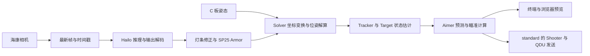

# SP25 树莓派与 Hailo 适配

**Raspberry Pi 5 · Hailo-8L · Hikrobot · QDU SharedTopic**

基于[同济大学 SuperPower 战队 SP25](https://github.com/TongjiSuperPower/sp_vision_25) 的 RoboMaster 视觉项目，将检测、相机与通信接口适配到 Raspberry Pi 5 和 Hailo-8L，保留 SP25 的位姿解算、目标跟踪、预测与瞄准主体。Hailo 模型及其输出约定参考青岛大学 QDU-Robomaster 的开源实现。

当前主要面向**步兵自瞄**。桌面视觉计算链路已跑通，支持无桌面环境下的浏览器预览、标定采图和性能统计；实车安装外参、闭环响应及其他兵种仍需继续验证。

> 发布范围：本文描述电脑端当前适配成果。本次只更新 README 和环境说明，GitHub 默认分支的其他源码尚未同步到该版本；运行下列命令前需核对代码版本，README 更新不代表远程源码已具备全部所述功能。

[环境配置](树莓派+NPU.md) · [编译运行命令](编译运行命令总手册.md) · [遗留问题](#已知问题与后续工作)

## 目录

- [功能与适配范围](#功能与适配范围)
- [运行环境](#运行环境)
- [快速开始](#快速开始)
- [处理流程与代码来源](#处理流程与代码来源)
- [效果与性能](#效果与性能)
- [已知问题与后续工作](#已知问题与后续工作)
- [目录结构](#目录结构)
- [文档与维护](#文档与维护)
- [参考与许可证](#参考与许可证)

## 功能与适配范围

| 部分 | 当前状态 |
| --- | --- |
| 海康相机 | ARM64 SDK 接入，统一 BGR 图像，支持最新帧读取、时间戳、超时与重连处理 |
| Hailo 检测 | 通过 HailoRT 加载 HEF，完成预处理、输出解码、候选筛选和灯条角点修正 |
| SP25 上层算法 | 接入 Armor、Solver、Tracker、Target、Aimer 与正式入口的 Shooter 调用 |
| QDU 通信 | 接入 USB CDC / SharedTopic；已有真实姿态接收与主机发送记录，执行结果需结合电控核对 |
| 可视化与标定 | 两个步兵入口支持浏览器预览；复用 SP25 标定程序并补充网页采图 |
| 性能统计 | 输出相机和视觉计算 FPS、阶段耗时、帧龄、CPU、内存及温度 |
| 其他兵种与功能 | 保留相关源码或接口；哨兵、UAV、MPC、打符等尚未完成本平台完整适配验收 |

`standard_readonly` 在代码中强制禁止串口发送，用于检查视觉计算结果。`standard` 可按配置发送瞄准指令；`auto_fire: false` 仅关闭开火请求，**不禁止云台指令发送**。

## 运行环境

### 上游原始环境

以下来自 [SP25 官方 README](https://github.com/TongjiSuperPower/sp_vision_25#31-项目环境)，用于说明移植前后的差异。

| 类别 | SP25 上游公开基线 |
| --- | --- |
| 计算平台 | Intel NUC12WSKI7，i7-1260P，16 GB 内存，x86_64 |
| 操作系统 | Ubuntu 22.04 |
| 推理后端 | OpenVINO，使用原项目模型 |
| 相机与镜头 | Hikrobot MV-CS016-10UC，6 mm 镜头 |
| 下位机与通信 | RoboMaster C 板；USB2CAN 或虚拟串口，使用原项目协议 |

### 本次适配环境

| 类别 | 当前部署基线 |
| --- | --- |
| 主机 | Raspberry Pi 5，四核 Cortex-A76，2 GiB 内存，ARM64 / AArch64 |
| AI 加速器 | Hailo-8L，通过 PCIe 接入 |
| 操作系统 | Debian GNU/Linux 13（trixie），无图形桌面 |
| 推理运行时 | HailoRT **4.24.0**，当前 CMake 精确要求此版本 |
| 检测模型 | `szu_int16_head_l.hef`；模型输入 640×512 RGB |
| 相机与镜头 | Hikrobot MV-CS016-10UC，8 mm 镜头；当前输出 720×540 BGR |
| 下位机与通信 | RoboMaster C 板运行 QDU 固件，经 USB CDC 串口使用 SharedTopic 协议 |
| 开发环境 | Windows 管理源码与 Git；WSL Ubuntu 22.04 用于部分离线检查；Pi 原生编译运行 |

构建使用 C++17、CMake、OpenCV、Eigen3、yaml-cpp、fmt、spdlog、nlohmann-json、HailoRT 和海康 SDK。当前默认步兵链路不依赖 ROS；原导航相关接口另有依赖。

安装、版本检查、模型和设备配置见 [环境配置与部署](树莓派+NPU.md)。本仓库不是包含系统驱动和 HEF 的一键安装包。

## 快速开始

下面的命令均在**树莓派终端**执行，假设源码已放在 `~/sp_vision_25-main`，并已按环境文档准备依赖、模型和设备。其他入口的完整命令见 [命令总手册](编译运行命令总手册.md)。

### 1. 检查本机配置

打开 [configs/standard3.yaml](configs/standard3.yaml)，核对 `hef_path`、`serial_number`、`qdu_communication.device` 和 `enemy_color`。仓库中的模型绝对路径和设备序列号来自现有测试机，新设备需替换。

### 2. 编译

生成构建目录并编译两个步兵入口；这一步不会启动设备。2 GiB 内存的 Pi 先使用 `-j2`，内存不足时改为 `-j1`。

```bash
cd ~/sp_vision_25-main
cmake -S . -B build/pi-standard
cmake --build build/pi-standard --target standard standard_readonly -j2
```

成功后，程序位于 `build/pi-standard/`。

### 3. 只读运行与预览

连接能持续发送有效姿态的 C 板，运行 30 秒。程序读取相机和姿态，计算跟踪与瞄准结果，但不向串口发送命令。

```bash
./build/pi-standard/standard_readonly configs/standard3.yaml --seconds=30 --preview-port=8080
```

电脑与 Pi 在同一网络时，在电脑浏览器打开 `http://<树莓派IP>:8080/`。可用 `hostname -I` 查询 Pi 的 IP；运行期间可按 `Ctrl+C` 提前退出。

正常时预览持续更新，终端 `rx_q` 增长、`pipeline_fps` 大于 0，结束时 `tx=0`。没有目标时 `det=0` 是可能的正常结果；持续出现 `waiting for fresh IMU` 表示姿态尚未满足计算条件。

没有真实姿态时，按[命令总手册](编译运行命令总手册.md)第 2.1 节运行模拟器。模拟器仅代替姿态输入，仍需要真实相机与 Hailo；它不能验证真实电控或装车坐标。

正式发送使用 `standard`，具体见命令总手册第 1 节。同一时刻只运行一个使用相机、Hailo 和相应串口的程序。

## 处理流程与代码来源



本项目复用青大的模型和协议约定，将其接入 SP25 数据结构与调用接口；没有整体搬入青大的运行框架。

| 部分 | 来源与本次工作 | 主要位置 |
| --- | --- | --- |
| 解算、跟踪与瞄准 | 以 SP25 原有模块为主体，保留上层组织和接口 | `tasks/auto_aim/solver.cpp`、`tracker.cpp`、`target.cpp`、`aimer.cpp` |
| 模型与输出适配 | 复用 QDU HEF；参考 ArmorDetector 的预处理、输出布局、anchor 和角点约定，新增返回 SP25 Armor 的适配层 | `tasks/auto_aim/yolo.cpp`、`tasks/auto_aim/hailo/` |
| Hailo 运行时 | 使用官方 HailoRT C++ API，封装模型加载、推理、缓冲和输出处理 | `tasks/auto_aim/hailo/hailo_runtime.cpp`、`hailo_output.cpp` |
| 相机与帧管理 | 基于 SP25 海康入口适配设备配置、ARM64 SDK 与异常恢复，新增帧缓冲管理 | `io/hikrobot/`、`io/camera.cpp`、`io/camera_frame.*` |
| 通信 | 按 QDU LibXR / SharedTopic 格式实现收发，接入 SP25 CBoard / Gimbal 接口 | `io/qdu_shared_topic*`、`io/cboard.*`、`io/gimbal/` |
| 灯条角点修正 | 延续 SP25 网络检测后结合灯条修正的思路，适配当前 Hailo 候选与图像 | `tasks/auto_aim/lightbar_refiner.cpp` |
| 标定与预览 | 复用原标定流程，增加网页预览、终端单键保存和共用圆点检测 | `calibration/`、`tools/live_preview.hpp`、`tasks/auto_aim/preview.hpp` |
| 性能优化与统计 | 增加阶段统计，减少低分候选转换和图像重复遍历 | `tools/pipeline_stats.hpp`、模型解码与灯条修正文件 |

## 效果与性能

> 待补图：硬件连接与整体布局。
>
> 待补图：浏览器中的检测框、跟踪模型、预测装甲板及瞄准点。
>
> 待补图：标定采图与终端性能统计。

下表为已有测试记录，不代表所有场景或后续版本均保持同样性能。

| 项目 | 已记录结果 | 测试范围 |
| --- | --- | --- |
| 视觉计算吞吐 | 约 99.3 / 100.2 FPS，两轮各 30 秒 | 相机约 120 FPS，模拟姿态，开启预览，基本全程有目标，OpenCV 4 线程 |
| 处理帧龄 | 100.2 FPS 那轮平均 15.41 ms | 主机接收图像至瞄准命令算好，不包含完整曝光、传输和电控执行延迟 |
| 相机内参标定 | 重投影误差 0.0417 px | 2026-09-25，8 mm 镜头，720×540，2×2 下采样，旋转 180° |

`camera_fps` 是相机采集帧率；`pipeline_fps` 是完成检测、跟踪和瞄准计算的帧率，包含无目标帧；`preview_pub_fps` 是编码预览的频率。预览约 10 Hz，不代表算法只运行 10 FPS。`cpu_pct=100` 表示约一个 CPU 核心的占用。

当前 YAML 默认相机帧率为 100 FPS，上表的 120 FPS 是性能测试条件。本地详细记录位于 `docs/9.26-pipeline-performance-check.md`，本次未上传。目前尚无与青大全流程在相同条件下的有效性能对比，不能据此判断两套算法的实车优劣。

## 已知问题与后续工作

- **安装外参与坐标系**：当前旋转、平移和 IMU 换轴参数仍有临时值，需安装固定后测量、标定并验证。
- **四板模型伸缩**：单板手持测试中曾出现估计模型大小波动和角点不稳定，原因尚未定位，不能直接归因于“没有整车”。
- **实车闭环**：需要核对电控接收值、云台响应、时序、弹道与异常停发行为；主机发送计数不能代替执行确认。
- **长期运行与交付**：继续补充长时间运行、热状态、断连恢复和版本对应记录；完整主程序自启动尚未验收。
- **其他功能**：哨兵、UAV、MPC、能量机关等需要各自的模型、设备和流程适配，不能只靠复制步兵 YAML 完成。

本地详细状态与关闭条件记录于 `docs/9.26-stage-status-and-open-issues.md`，本次未上传。

## 目录结构

```text
sp_vision_25-main/
├── src/                 # standard、standard_readonly 等程序入口
├── tasks/auto_aim/      # 检测、解算、跟踪、预测与瞄准模块
│   └── hailo/          # HailoRT、模型输出与解码适配
├── io/                  # 海康相机、帧管理与 QDU 通信
├── tools/               # 数学、日志、预览、性能统计等公共工具
├── configs/             # 设备、算法与标定参数
├── calibration/         # 采图、内参和手眼标定
├── tests/               # 离线回归、回放和手动硬件诊断
├── docs/                # 适配记录、问题跟踪与学习资料
└── build/               # 本机构建、临时验证和运行结果，Git 忽略
```

## 文档与维护

| 文档 | 用途 |
| --- | --- |
| [Raspberry Pi 5 与 Hailo-8L 环境配置与部署](树莓派+NPU.md) | 软件依赖、SDK、模型、设备与配置检查 |
| [编译运行命令总手册](编译运行命令总手册.md) | 正式入口、只读入口、模拟器、标定和回放命令 |
| 本地 `tests/README.md`（本次未上传） | 测试分类、依赖和验证范围 |
| 本地 `docs/9.26-project-learning-and-maintenance-plan.md`（本次未上传） | 模块阅读顺序、基础知识与排错方法 |
| 本地 `docs/9.27-main-source-sync.md`（本次未上传） | PC Git、源码导出与 Pi 一致性检查 |

以电脑 Git 为源码基准，修改先在电脑提交，再同步同一提交的完整主源码到 Pi。主源码交付不包含 Git 历史、文档、构建产物、日志和采集图片；Pi 校验通过后才记为同步完成。临时诊断产物放 `build/`，不为清理目录而删除现有测试或第三方工作区。

`autostart.sh` 当前只运行相机诊断，不是完整视觉程序的开机服务。

## 参考与许可证

- [TongjiSuperPower / sp_vision_25](https://github.com/TongjiSuperPower/sp_vision_25)：工程与上层算法基础。
- [QDU-Robomaster 算法组](https://qdu-robomaster.github.io/%E7%AE%97%E6%B3%95%E7%BB%84)：硬件适配参考与模块索引。
- [QDU-Robomaster / ArmorDetector](https://github.com/QDU-Robomaster/ArmorDetector)：Hailo 模型及输入输出约定参考。
- [QDU-Robomaster / HikCamera](https://github.com/QDU-Robomaster/HikCamera)、[CameraFrameSync](https://github.com/QDU-Robomaster/CameraFrameSync)：相机与同步方案参考。
- [HailoRT](https://github.com/hailo-ai/hailort/tree/v4.24.0)：Hailo 官方推理运行时与 API。

本仓库保留 SP25 的 [MIT License](LICENSE) 及原版权声明。第三方 SDK、模型和依赖遵循各自的许可条件。
